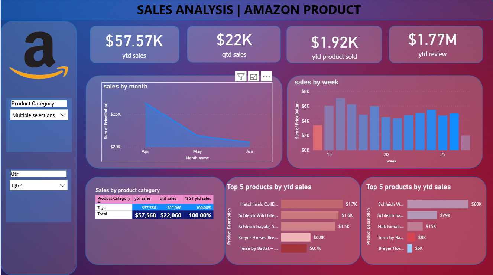

# 📊 Amazon Product Sales Analysis – Power BI Dashboard

## 🔍 Project Overview
This project presents a **Sales Analysis Dashboard for Amazon Products** built using **Power BI**.  
It provides deep insights into:

- Year-to-Date (YTD) Sales
- Quarter-to-Date (QTD) Sales
- Product-wise performance
- Weekly & Monthly sales trends
- Top 5 best-selling products

The dashboard helps stakeholders track business performance and make data-driven decisions.

---

## 🖼 Dashboard Preview

---

## 🛠 Tools & Technologies Used
- **Power BI** – Data Visualization & Reporting  
- **Excel / CSV** – Dataset Handling  
- **DAX** – Measures & Calculations  
- **Power Query** – Data Cleaning & Transformation  

---

## 📌 Key KPIs Displayed
- **YTD Sales:** $57.57K  
- **QTD Sales:** $22K  
- **YTD Product Sold:** 1.92K  
- **YTD Reviews:** 1.77M  

---

## 📈 Visualizations Included
- ✅ Sales by Month (Line Chart)
- ✅ Sales by Week (Bar Chart)
- ✅ Sales by Product Category (Table)
- ✅ Top 5 Products by YTD Sales (Bar Chart)
- ✅ Filters:
  - Product Category
  - Quarter Selection

---

## 📁 Project Folder Structure

